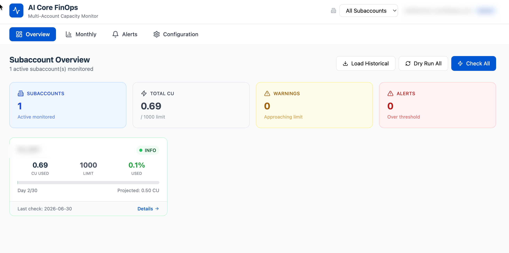

# SAP BTP AI Core Consumption Monitor

[](https://api.reuse.software/info/github.com/SAP-samples/btp-ai-core-consumption-monitor)

> **Disclaimer:** This tool is provided as-is and is not covered by SAP Support. This is not a replacement of the official billing documents you receive from SAP. The information provided by this tool is purely indicative. SAP does not guarantee the accuracy of the data displayed.

## Description

This application monitors and visualizes **SAP AI Core capacity unit (CU) consumption** across multiple BTP subaccounts. It fetches data from the SAP BTP Usage and Accounting Service (UAS) APIs and provides both a **Technical View** (CU per model, tokens) and a **Commercial View** (billing costs) of AI Core usage.

The application helps FinOps teams and platform administrators to:
- Track AI Core spending against monthly budgets
- Identify which models/applications consume the most capacity units
- Get alerted when consumption approaches configured thresholds
- View historical consumption trends month over month
- Understand the cost breakdown (Inference CU, Grounding CU, GenAI Token CU, Data Indexed CU)




## Architecture


| Layer | Technology |
|-------|-----------|
| Backend | SAP Cloud Application Programming Model (CAP) — Node.js |
| Database | SAP HANA Cloud (HDI Container) |
| Frontend | React 18, Vite, Tailwind CSS, Recharts, Lucide Icons |
| Authentication | SAP XSUAA |
| Data Source | BTP Usage & Accounting Service (UAS) APIs |
| Notifications | SMTP (Nodemailer), SAP Alert Notification Service |

## Requirements

### SAP BTP Services

| Service | Plan | Required |
|---------|------|----------|
| SAP HANA Cloud | hdi-shared | ✅ Yes |
| XSUAA | application | ✅ Yes |
| UAS (Usage & Accounting) | reporting-ga-admin | ✅ Yes |
| Destination Service | lite | ✅ Yes |
| HTML5 Application Repository | app-host | ✅ Yes |
| Job Scheduling Service | standard | ❌ Optional (Recommended) |
| Alert Notification Service | standard | ❌ Optional |

### Development Tools

- Node.js >= 20
- SAP Cloud Application Programming Model (CAP) — `@sap/cds-dk`
- Cloud Foundry CLI (`cf`)
- MBT Build Tool (`mbt`) — for MTA builds
- SAP BTP Cloud Foundry environment with HANA Cloud

## Download and Installation

### 1. Clone

```bash
git clone https://github.com/SAP-samples/btp-ai-core-consumption-monitor.git
cd btp-ai-core-consumption-monitor
```

### 2. Install Dependencies

```bash
npm install
cd app/dashboard && npm install && cd ../..
```

### 3. Build & Deploy

The project uses scripts defined in `package.json`. Execute them with `npm run <script>`:

| Script | Command | Description |
|--------|---------|-------------|
| `build` | `npm run build` | Build the MTA archive (`ai-core-finops.mtar`) |
| `deploy` | `npm run deploy` | Deploy the MTA archive to Cloud Foundry |
| `undeploy` | `npm run undeploy` | Remove all deployed apps and services |

```bash
# Build MTA archive
npm run build

# Deploy to Cloud Foundry
npm run deploy

# Undeploy (removes all services)
npm run undeploy
```

## Configuration

After deployment:

1. Open the application via BTP Launchpad or directly via the HTML5 app URL
2. Navigate to **Configuration** tab
3. **Add a subaccount** — enter the Subaccount ID (UUID), display name, and monthly spending limit
4. Click **"Run Check"** on the Overview page to fetch current data
5. Click **"Load Historical"** to backfill historical consumption data

## Security – Roles & Authorization

The application defines two role templates in `xs-security.json`:

| Role Collection | Role Template | Access |
|----------------|---------------|--------|
| `AICore_FinOps_Admin` | Admin | Full access — manage configuration, trigger checks, view all data, manage notifications |
| `AICore_FinOps_Viewer` | Viewer | Read-only — view dashboards, monthly data, and alert history |

### Current State

Authentication via XSUAA is **enabled** in production (users must log in), but role-based authorization (`@requires` annotations) is **currently disabled** for ease of initial setup and testing. This means any authenticated user has full access to all features.

### Enabling Role-Based Access

To restrict access by role:

1. **`srv/service.cds`** — Uncomment the `@requires` annotations:
   ```cds
   @requires: ['Viewer', 'Admin', 'system-user']
   service FinOpsService { ... }
   
   @requires: 'Admin'
   entity MonitoringConfigs ...
   ```

2. **BTP Cockpit** — Assign the role collections (`AICore_FinOps_Admin`, `AICore_FinOps_Viewer`) to users or user groups.

3. **`app/dashboard/src/App.jsx`** — Restore role-based UI gating:
   ```javascript
   const isAdmin = userInfo?.roles?.includes('Admin')
   ```

> **Note:** The `package.json` already has `"auth": { "kind": "xsuaa" }` configured under `[production]`, so no change is needed there.

## Job Scheduling (Optional but Recommended)

The application can use the **SAP BTP Job Scheduling Service** for automated daily monitoring checks. While optional, it is **recommended** to enable the Job Scheduler to ensure consumption data is fetched automatically and alerts are triggered in a timely manner.

### Without Job Scheduler (Default)

Use the **"Run Check"** or **"Check All"** buttons in the UI to manually pull fresh data from the UAS API. This is the default deployment configuration.

### Enabling Job Scheduler

1. In `mta.yaml`, uncomment the scheduler resource and binding:

```yaml
# modules > ai-core-finops-srv > requires:
- name: ai-core-finops-scheduler

# resources:
- name: ai-core-finops-scheduler
  type: org.cloudfoundry.managed-service
  parameters:
    service: jobscheduler
    service-plan: standard
    config:
      enable-xsuaa-support: true
```

2. Rebuild and redeploy.

The application will automatically register a daily cron job (07:00 UTC) that:
- Fetches current month usage for all active subaccounts (technical + commercial)
- Stores/updates consumption records in HANA
- Sends notifications (email/ANS) if thresholds are breached
- On days 1–3 of a new month, also finalizes the previous month's commercial data

## Notifications

The application supports two notification channels:

| Channel | Description |
|---------|-------------|
| **SMTP Email** | Rich HTML emails with CU breakdown, progress bars, model details |
| **SAP ANS** | Structured events posted to Alert Notification Service |

Configure notifications in the **Configuration** → **Notification Settings** section. Both channels can be independently enabled/disabled.

## Road Map

| Feature | Description | Status |
|---------|-------------|--------|
| CMS Service Integration | Integration with Cloud Management Service (CMS) for fetching sub account information through API — enabling automatic discovery and onboarding of subaccounts | 🔜 Planned |

## Known Issues

- Token data (input/output) is only available for GenAI models (GPT, Claude, etc.) — vector_storage and retrieval_text show "—" for tokens
- Commercial cost data from `monthlySubaccountsCost` may not be immediately available for the current month (SAP processes with a delay)
- The "Projected" metric uses simple linear extrapolation and may not reflect actual month-end usage

## How to Obtain Support

This is an open-source sample application. **SAP does not provide official support.**

If you encounter issues or have questions:

- 🐛 **Bugs** — Please [create an issue](https://github.com/SAP-samples/btp-ai-core-consumption-monitor/issues) in this repository
- 💡 **Feature Requests** — Open an [issue](https://github.com/SAP-samples/btp-ai-core-consumption-monitor/issues) with the `enhancement` label
- 💬 **Questions** — Use [GitHub Discussions](https://github.com/SAP-samples/btp-ai-core-consumption-monitor/discussions) or open an issue

For additional support, [ask a question in SAP Community](https://answers.sap.com/questions/ask.html).

Please check existing issues before creating new ones.

## Contributing

If you wish to contribute code, offer fixes or improvements, please send a pull request. Due to legal reasons, contributors will be asked to accept a DCO when they create the first pull request to this project. This happens in an automated fashion during the submission process. SAP uses [the standard DCO text of the Linux Foundation](https://developercertificate.org/).

## Code of Conduct

We as members, contributors, and leaders pledge to make participation in our community a harassment-free experience for everyone. Please read and follow our [Code of Conduct](https://github.com/SAP-samples/.github/blob/main/CODE_OF_CONDUCT.md).

## License

Copyright 2026 SAP SE or an SAP affiliate company and btp-ai-core-consumption-monitor contributors. Please see our [LICENSE](LICENSE) for copyright and license information. Detailed information including third-party components and their licensing/copyright information is available [via the REUSE tool](https://api.reuse.software/info/github.com/SAP-samples/btp-ai-core-consumption-monitor).

---

> **Note:** This application is provided as a sample/reference implementation. It is not intended for production use without proper review, testing, and hardening. SAP does not guarantee the accuracy of the data displayed and recommends verifying against the official BTP Cockpit usage reports.